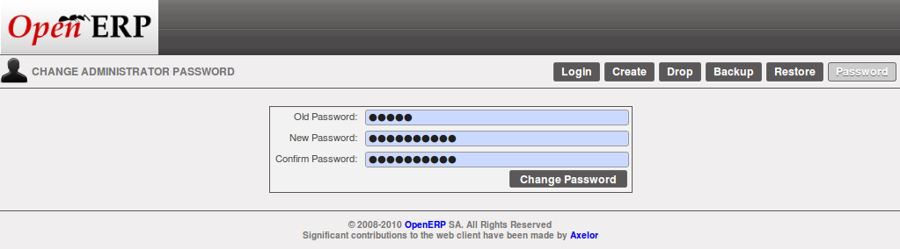
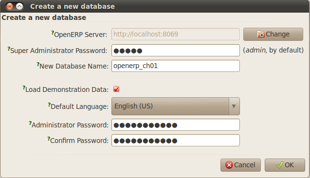
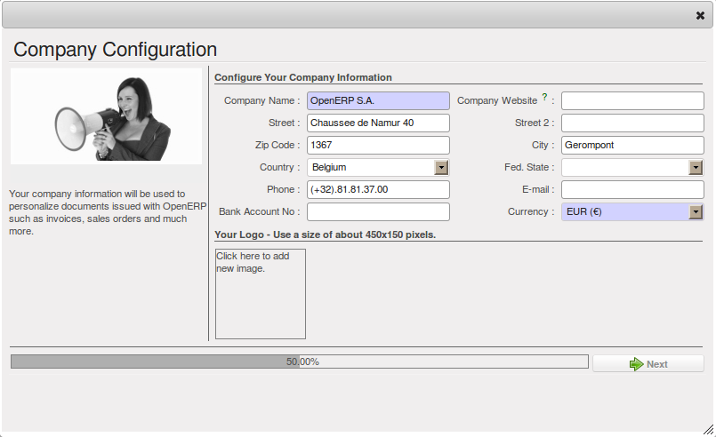

.. index::
   single: database; create
   single: database

.. _sect-dbcreate:

Criação de banco de dados
=========================

Use a técnica descrita nesta seção para criar um novo banco de dados, \ ``openerp_ch01`` \. Este
banco de dados conterá os dados de demonstração fornecidos com OpenERP e uma grande proporção do
núcleo funcionalidade OpenERP. Você vai precisar saber a senha do super administrador para este – ou
você terá que encontrar alguém que o tenha para criar este banco de dados.

.. index::
   single: password; super-administrator
   single: password; superadmin

.. note:: A senha do Super-administrador

  Qualquer pessoa que conheça a senha de super-administrador tem acesso completo aos dados no servidor
   – capaz de ler, alterar e excluir qualquer um dos dados em qualquer das bases de dados lá.

   Após a primeira instalação, a senha é ``admin``. Este é o padrão embutido, e
   é usado se não houver nenhum arquivo de configuração acessíveis servidor. Se o seu sistema tenha sido
configurar para que o arquivo de configuração do servidor pode ser gravado pelo servidor, então
você pode alterar a senha através do cliente. Ou você pode deliberadamente fazer o
arquivo de configuração somente leitura, para que não há perspectiva de alterá-lo a partir do cliente.
De qualquer forma, um servidor de administrador de sistemas pode mudá-lo se você esquecê-la.
   
   Portanto, se seu sistema está configurado para permitir que ele, você pode alterar a senha superadmin através do cliente GTK
    a partir do menu :menuselection:`File --> Databases --> Administrator Password`, ou através do
cliente web por efetuar logout (clique no :guilabel:`Logout` link), clicando :guilabel:`Databases` na
    tela de login, e em seguida clicando no botão na tela de Gestão. :guilabel:`Password` 
   
   A localização do arquivo de configuração do servidor é normalmente definido ao iniciar o servidor com
    a opção de linha de comando``--config``.

   *Alterando a senha de super administrador através do cliente web*

.. _sect-creatingdb:

Criando o banco de dados
------------------------

Se você estiver usando o cliente GTK, escolha :menuselection:`File --> Databases --> New database`  no
o menu no canto superior esquerdo. Digite a senha do super administrador, então o nome do novo banco de dados que
você está criando.

   *Criando um novo banco de dados através do cliente GTK*  

Se você estiver usando o cliente da Web, clique na tela de login :guilabel:`Databases`, então na página de gerenciamento de banco de dados
:guilabel:`Create`. Digite a senha do administrador-super, eo
nome do novo banco de dados que você está criando.
  
Em ambos os casos, você verá uma caixa de seleção que determina se você carregar dados de demonstração ou não.
As conseqüências de marcar essa caixa ou não afetar a **utilização inteira** deste banco de dados.

Em ambos os casos, você também vai ver que você pode escolher a senha do administrador. Isso faz com que o seu
banco de dados seja bastante seguro, pois você pode garantir que ele é único, desde o início.
(Na verdade muitas pessoas acham difícil resistir ``admin`` como a sua senha!)

Database openerp_ch01
---------------------

.. index::
   pair: account; user

Aguarde a mensagem mostrando que o banco de dados foi criado com sucesso, junto com o usuário
contas e senhas (\ ``admin/XXXX``\  e \ ``demo/demo``\  ). Agora que você criou esse
banco de dados, você pode estendê-lo sem ter que saber a senha de super administrador.

.. index::
   single: access; LDAP
   single: LDAP
   pair: password; username
   single: access; user

.. tip::   Acesso de Usuário

	A combinação de usuário / senha é específica para um único banco de dados. Se você tiver direitos administrativos
de um banco de dados você pode modificar todos os usuários.

 	.. index::
	   single: module; users_ldap

	Alternativamente, você pode instalar o módulo :mod:`users_ldap`, que gerencia a autenticação de usuários
no LDAP (the Lightweight Directory Access Protocol, a standard system), e conectá-lo a vários
Bancos de dados OpenERP. Usando isso, muitos bancos de dados podem compartilhar a mesma conta detalhes do usuário.

.. note::  Falha para criar um banco de dados

	Como você sabe se você criou com sucesso o seu novo banco de dados?
Você é dito se a criação de banco de dados não foi bem sucedida.
Se você tiver digitado um nome de banco de dados usando caracteres proibidos (ou o nome de nenhum, ou um nome muito curto),
	você será alertado pela caixa de diálogo :guilabel:`Bad database name!` explicando como corrigir o erro.
	Se você digitou a senha de super-administrador errado ou um nome já em uso
	(alguns nomes podem ser reservados sem o seu conhecimento), você será alertado pela caixa de diálogo
	:guilabel:`Error during database creation!`.

Pois esta é a primeira vez que você se conecta a este banco de dados, você será solicitado uma série de perguntas para
definir os parâmetros do banco de dados. Você pode optar por :guilabel:`Skip Configuration Wizards` ou
:guilabel:`Start Configuration`. Se você optar por configurar seu aplicativo, você poderá prosseguir com a
seguintes passos:

	#.  :guilabel:`Configure Your Interface` : selecione \ ``Simplified`` \ e clique em :guilabel:`Next`.

	#.  :guilabel:`Configure Your Company Information` : substitua o padrão proposto \ ``OpenERP S.A.`` \
	    pelo seu próprio nome da empresa, completo, tanto do seu endereço de como você gosta. Você pode definir a moeda que
sua empresa utiliza ou deixe a configuração padrão. Você também pode adicionar o logotipo da empresa que irá
ser visível nos relatórios e outros documentos. Clique em :guilabel:`Next`.

	#.  :guilabel:`Install Applications` : verifique os aplicativos que você precisa e clique em :guilabel:`Install`.
	    Por enquanto, não instale qualquer aplicativo.

Uma vez que a configuração estiver concluída, você está conectado ao seu sistema OpenERP. Sua funcionalidade é muito
limitada, porque você tem selecionado uma interface com nenhuma aplicação instalada :guilabel:`Simplified`,
mas isto é suficiente para demonstrar que a instalação está funcionando.

   *Definição de sua empresa durante a configuração do banco de dados inicial*

.. index::
   single: database; manage

.. _sect-dbmanage:

Gerenciando bancos de dados
---------------------------

Como um super administrador , você não só tem direitos para criar novos bancos de dados, mas também para:

* Bancos de dados de backup,

* excluir bancos de dados,

* restaurar bancos de dados.

Todas estas operações podem ser realizadas a partir do menu :menuselection:`File --> Databases...`
no cliente GTK, ou a partir do botão :guilabel:`Databases` no web do cliente

:guilabel:`Login` screen.

.. index::
   single: database; backup

.. tip:: Backup (cópia) de um  banco de dados

        Para fazer uma cópia de um banco de dados, vá para a web :guilabel:`Login`tela e clique no botão :guilabel:`Databases`.
        Em seguida, clique no botão :guilabel:`Backup` , selecione o banco que deseja copiar e digite a senha do super admistrador. Clique no botão :guilabel:`Backup` para confirmar que você deseja copiar o banco de dados.

.. index::
   single: database; drop

.. tip:: Drop (excluir) um banco de dados

        Para excluir um banco de dados, vá na tela web :guilabel:`Login`  e clique no botão :guilabel:`Databases`.
        Em seguida, clique no botão :guilabel:`Drop`, selecione o banco que deseja excluir e insera a senha do super administrador. Clique no botão :guilabel:`Drop` para confirmar que você deseja excluir o banco de dados.

.. index::
   single: database; restore

.. tip:: Restaurar um banco de dados

        Para restaurar um banco de dados, vá na tela web :guilabel:`Login` e clique no botão :guilabel:`Databases`.
        Em seguida, clique no botão :guilabel:`Restore`, clique no botão :guilabel:`Choose File` para selecionar o banco de dados
        que deseja restaurar. Dê o banco de dados de um nome e digitar a senha de super administrador.
	Clique no botão :guilabel:`Restore` para confirmar que você deseja instalar uma nova cópia do banco de dados selecionado.
Para restaurar um banco de dados, você precisa ter uma cópia existente, é claro.

.. index::
   single: database; duplicate

.. tip::   Duplicação de um banco de dados

	Para duplicar um banco de dados, você pode:

        #. fazer um arquivo de backup em seu PC a partir deste banco de dados.

        #. restaurar este banco de dados do arquivo de backup no seu PC, e dar-lhe um novo nome.

	Esta pode ser uma maneira útil de fazer um banco de dados de ensaio de um banco de dados de produção. Você pode experimentar a
operação de uma nova configuração, novos módulos, ou apenas a importação de novos dados.

.. index::
   single: Acesso

Um administrador de sistema pode configurar OpenERP para restringir o acesso a algumas dessas funções de banco de dados
de modo que sua segurança está reforçada em uso em produção normal.

Agora você está pronto para usar bancos de dados de sua instalação para se familiarizar com a
administração e utilização de OpenERP.

Nova funcionalidade OpenERP
===========================

O banco de dados que você criou e conseguiu até agora é com base na funcionalidade do núcleo OpenERP que você está
instalado. O núcleo do sistema é instalado no sistema de arquivos do seu servidor de aplicação OpenERP, mas
instalado somente em um banco de dados OpenERP como você precisar, como é descrito no próximo capítulo, :ref:`ch-guided`.

E se você quer atualizar o que está lá, ou ampliar o que está lá com módulos adicionais?

* Para atualizar o que você tem, seria necessário instalar uma nova instância OpenERP usando as mesmas técnicas
   descrito anteriormente nesta seção, :ref:`sect-dbcreate`.

* Para estender o que você tem, seria necessário instalar novos módulos no ``addons`` diretório de sua atual
   instalação OpenERP. Existem várias maneiras de fazer isso.

.. index::
   pair:  system; administrator

Em ambos os casos, você precisa ser um \ ``root`` \ usuário ou \ ``Administrator`` \ de seu servidor de aplicativos OpenERP.

Estendendo OpenERP
-----------------

Para estender OpenERP você precisará copiar os módulos para o diretório  \``addons``\. Que está em
de seu diretório do servidor \ ``openerp-server`` \ (o que difere entre Windows, Mac e algumas das
várias distribuições Linux e não está disponível em todos os no Windows tudo em um instalador).

.. index::
   single: module; product
   single: module; purchase

Se você olhar lá você vai ver módulos existentes, tais como :mod:`product` and :mod:`purchase`. Um
módulo pode ser fornecido na forma de arquivos dentro de um diretório ou um arquivo zip contendo formato
que a estrutura mesmo diretório.

Você pode adicionar módulos de duas maneiras principais - através do servidor, ou através do cliente.

.. index::
   pair:  system; administration

Para adicionar novos módulos através do servidor é uma tarefa de administração sistema convencional. Como usuário \ ``root`` \
 ou outro usuário adequado, você deve colocar o módulo no diretório \ ``addons`` \ e mudar suas
permissões para coincidir com as dos outros módulos.

Para adicionar novos módulos por meio do cliente você deve primeiro alterar as permissões do diretório \ ``addons`` \
do servidor, de modo que é gravável pelo servidor. Que permitirá que você instale
Módulos OpenERP usando o cliente OpenERP (uma tarefa realizada em última instância sobre a aplicação
servidor, o software do servidor).

.. index::
   pair:  filesystem; permissions

.. tip:: Permissões de mudança

	Uma maneira muito simples de alterar as permissões no sistema Linux você está usando para develop OpenERP
uma aplicação está para executar o comando sudo chmod 777 <path_to_addons> (where <path_to_addons> é
o caminho completo para o diretório de addons, um local como /usr/lib/python2.5/site-packages/openerp-
	server/addons).

Qualquer usuário de OpenERP quem tem acesso aos menus de administração relevante pode, então, fazer upload de qualquer novo
funcionalidade, de modo que você certamente desativar esse recurso para uso em produção. Você vai ver exemplos de
este upload como você faz seu caminho através deste livro.

.. Copyright © Open Object Press. Todos os direitos reservados.

.. Você pode levar cópia eletrônica desta publicação e distribuí-lo se você não
.. mudar o conteúdo. Você também pode imprimir uma cópia para ser lido somente por você.

.. Temos contratos com editoras diferentes em países diferentes para vender e
.. distribuir versões em papel ou eletrônicas baseadas deste livro (traduzido ou não)
.. em livrarias. Isso ajuda a distribuir e promover os produtos OpenERP. Também
.. nos ajuda a criar incentivos para pagar os colaboradores e autores com
.. os direitos do autor com essas vendas.

.. Devido a isso, concede a traduzir, modificar ou vender este livro é estritamente
.. proibido, a menos que Tiny SPRL(representando Open Object Press) lhe der uma
.. autorização por escrito para isso.

.. Muitas das designações usadas pelos fabricantes e fornecedores para distinguir seus
.. produtos são as marcas registradas. Onde essas designações aparecem neste livro,
.. e Open Object Press tinha conhecimento de uma reivindicação da marca registrada, as designações foram
.. nas letras maiúsculas iniciais.

.. Embora toda precaução foi tomada na preparação deste livro, a editora
.. e os autores não assumem nenhuma responsabilidade por erros ou omissões, ou por danos
.. resultantes do uso das informações aqui contidas.

.. Publicado por Open Object Press, Grand Rosière, Bélgica

