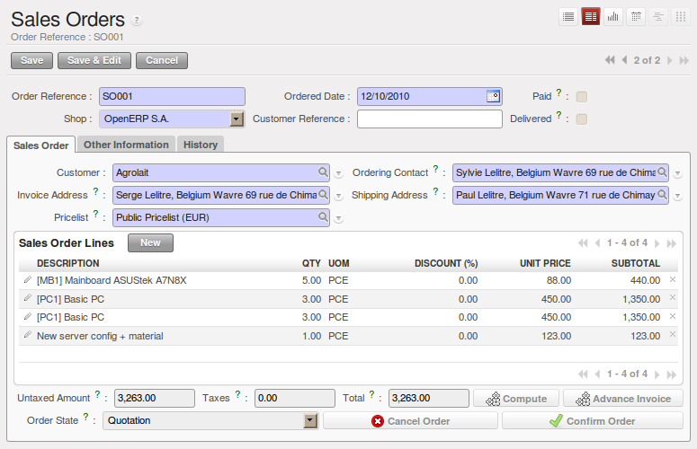
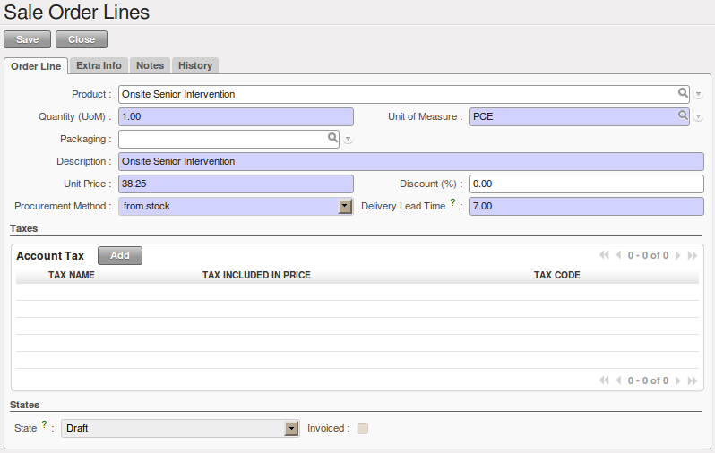
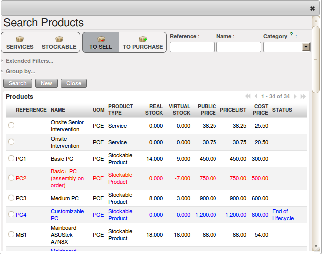
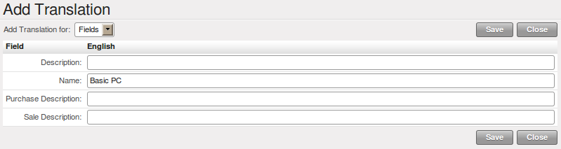
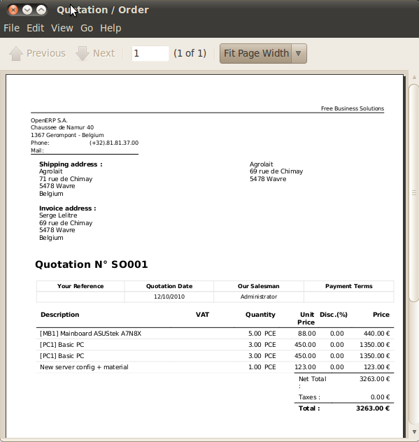
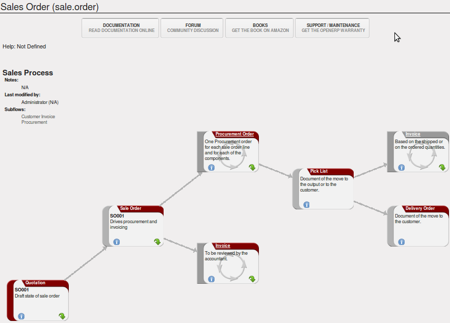

Gestão Orçamentos de Vendas
===========================

Em OpenERP, uma citação e uma ordem são tratados da mesma forma (um pedido de venda), mas em estados diferentes. você
pode considerar um pedido a ser uma cotação que tem evoluído, porque tem sido confirmado pelo
cliente. Ou, inversamente, que uma cotação é um pedido que não foi validado ou cancelado ainda.
Ambos suas cotações e pedidos de vendas pode ser aberto usando o menu :menuselection:`Sales
--> Sales --> Sales Orders`.

Para inserir os detalhes de uma nova cotação, você pode usar o menu :menuselection:`Sales -->
Sales --> Sales Orders` em seguida, selecione :guilabel:`New`. OpenERP abre uma nova janela
o que lhe permite inserir dados em um novo formulário de cotação em branco. Você também pode criar uma cotação diretamente de uma oportunidade, como foi explicado no capítulo anterior.

   *Nova cotação*

Algumas informações são automaticamente especificada pelo sistema:

* uma referência interna para a cotação ou pedido,

* o ponto de vendas que a encomenda será entregue a partir de,

* a data do pedido,

* A tabela de preços para o pedido de vendas atual.

Você pode modificar qualquer dessas informações antes de validar a cotação. o cliente
referência é mostrado no cabeçalho do pedido. Este campo é opcional para referência do próprio cliente –
se o cliente não fornecer uma, apenas deixá-lo vazio.

Você, então, inserir todos os dados sobre a ordem na guia :guilabel:`Sales Order`. Comece por digitar
o nome do cliente, selecionando o cliente correto na lista de clientes no sistema. A partir da citação, você pode
criar um novo cliente na mosca, se necessário – pressione :kbd:`<F1>` no campo vazio :guilabel:`Customer` para fazer isso, ou digite o nome, pressione a tecla `Tab` e depois clique `Create`. Na verdade, quando você digita um nome ou parte de um nome no campo ``Customer``, e OpenERP não encontrar um cliente correspondente, você verá o botão `Create` aparecem para permitir que você criar diretamente o cliente com o nome digitado.

Uma vez que o nome do cliente foi selecionado, diferentes campos do pedido estão concluídos
automaticamente, com base na configuração do formulário de sócio para que o cliente:

* :guilabel:`Ordering Contact` :pessoa que manuseia o pedido no final do cliente. Por padrão, OpenERP
propõe o contato Pedido ao parceiro selecionado

* :guilabel:`Delivery Address` : endereço usado no pedido de entrega. Por padrão, OpenERP propõe
   o endereço de entrega do formulário de sócio. Se nenhum endereço de entrega específica é definida, o padrão
   endereço será utilizado em seu lugar.

* :guilabel:`Invoice Address` :endereço usado para enviar a fatura para o cliente. Por padrão, o OpenERP
   propõe o endereço rotulados :guilabel:`Invoice` a partir do formulário do parceiro. Se nenhum endereço e fatura específica é definida, por padrão
   endereço será utilizado em seu lugar.

* :guilabel:`Pricelist` : irá determinar tanto a moeda da cotação eo preço que será
   ser usado para cada produto.

* :guilabel:`Payment Term` : disponível na aba :guilabel:`Other Information`, ele mostra o pagamento
   método que o cliente irá seguir, por exemplo ``30 Days End of Month``.

Você pode modificar qualquer um destes campos no pedido que você vá.

Você também pode configurar uma conta analítica para o seu fim. Esta conta será usada durante o faturamento para
gerar lançamentos contábeis correspondentes à fatura automaticamente. Isto é extremamente útil
para atribuição de receitas para o projeto ou caso especificado por este pedido.

.. tip::  Contas analíticas

   Se você estiver gerenciando por tarefa, a conta analítica a ser selecionado é aquele que corresponde a
    o projeto para o pedido.
   As vendas realizadas pela o pedido podem ser alocados para o projeto de modo que a rentabilidade
    cálculos podem ser feitos.

Uma vez que a informação tenha sido inserido, você pode inserir dados para as linhas do pedido. Para fazer isso, crie uma
nova linha de pedido, como mostrado na figura :ref:`fig-slinf`.

.. _fig-slinf:

   *Entrando em uma nova linha de pedido de vendas*

Primeiro de tudo, escolha o produto que está a ser vendido para o cliente. OpenERP mostra alguns
informações úteis para a lista de produtos para ajudar você a fazer uma cotação de venda:

* :guilabel:`Real Stock` : fisicamente presente em seus armazéns. Este valor depende da Loja (ponto 
  de vendas) selecionados no cabeçalho do pedido. Lojas diferentes podem ser ligadas a diferentes armazéns.

* :guilabel:`Virtual Stock` : mostra um vendedor a quantidade que pode ser vendido, tendo em conta
   ambas as ações reservadas para outras ordens eo número de produtos planejados para chegar a curto prazo.

* :guilabel:`Public Price` : o preço de venda básico para o determinado produto. Ele fornece uma base para o
   vendedor para poder julgar se a oferecer um desconto para o cliente, e quanto de
   desconto deve ser

* :guilabel:`Pricelist` : (não pode ser mostrado, dependendo dos módulos instalados) depende das condições de preços anexada ao cliente, calculada sobre o preço de lista. Este é o preço que é proposto por padrão na cotação dos clientes, a menos que tenha sido modificado pelo vendedor.

* :guilabel:`Cost Price` : mostra o preço de custo do produto. Se o vendedor vende por menos
   do que este montante, a empresa incorre em uma perda.

   *seleção de um produto em uma linha de pedido de vendas*

Uma vez que o produto a ser vendido para o cliente tenha sido selecionado, automaticamente o OpenERP
completa de todos os outros campos obrigatórios: numa unidade de medida, descrição, preço unitário,
desconto, método de aquisição, prazos de entrega e impostos aplicáveis. Todas essas informações vem no
formulário do produto..

.. index::
   single: module; product_visible_discount

.. tip:: Desconto visível

   Se um preço com desconto é retirado de uma lista de preços, por padrão, essa figura é mostrado como o
    preço de venda ao cliente. Ele vai ver um desconto de 0%, juntamente com o preço unitário que é diferente
    do preço de lista.
   Se você instalar o módulo :mod:`product_visible_discount` from ``extra-addons``,
   você pode configurar se você quiser fazer o desconto
    explicitamente visível em um formulário de pedido como uma diferença percentual em relação ao preço de lista,
    ou apenas mostrar um preço unitário reduzido que na configuração padrão.

Quando você entra em uma cotação, o produto escolhido é apresentado na linguagem do cliente para que ele possa ver
o que ele está vendendo. A descrição do produto vendido pode também ser expressa na linguagem do cliente.
A tradução para o idioma do cliente é usada na cotação ou np pedido quando ele é impresso.

   *Venda de um produto em um idioma parceiro que difere da língua do usuário*

.. note:: Vendas únicas 

   Se um produto é vendido a um cliente apenas uma vez, você não tem que criar um formulário de produtos completamente novo
    apenas para essa venda.
    Você pode concluir manualmente todas as informações no pedido sem realmente criar um produto:
   descrição, quantidade, preço, prazo de entrega, impostos.
    Neste caso, OpenERP não irá gerar uma nota de entrega, porque a descrição pura não é um produto, e por isso não está em estoque.

Quando todos os produtos são introduzidos, você pode imprimir a cotação e enviá-lo para o cliente. para fazer
isso, clique no link :guilabel:`Quotation / Order` na seção :guilabel:`Reports` para a direita.
O OpenERP abre a cotação em PDF para que você possa verificá-lo antes de imprimir.

   *Impressão de uma cotação de venda*

Quando o pedido é confirmado pelo cliente, você pode confirmar a cotação para entregar em um pedido de vendas. Você também pode simplesmente cancelar a janela sem confirmar o pedido para deixá-lo em estado de cotação. Para ver todas as cotações atuais, você pode usar o menu :menuselection:`Sales --> Sales --> Sales Orders` e clique no botão de filtro :guilabel:`Quotations`.

Para acompanhar o processo de seu pedido, você pode clicar na visão de processos (indicado por um ponto de interrogação) do formulário de encomenda. O OpenERP
mostra uma visão de processos interativos desse pedido. Para mais informações sobre o seu uso,
olhe para :ref:`ch-process`.

   *Visão em processo para um pedido de venda*

.. Copyright © Open Object Press. Todos os direitos reservados.

.. Você pode levar cópia eletrônica desta publicação e distribuí-lo se você não
.. mudar o conteúdo. Você também pode imprimir uma cópia para ser lido somente por você.

.. Temos contratos com editoras diferentes em países diferentes para vender e
.. distribuir versões em papel ou eletrônicas baseadas deste livro (traduzido ou não)
.. em livrarias. Isso ajuda a distribuir e promover os produtos OpenERP. Também
.. nos ajuda a criar incentivos para pagar os colaboradores e autores com
.. os direitos do autor com essas vendas.

.. Devido a isso, concede a traduzir, modificar ou vender este livro é estritamente
.. proibido, a menos que Tiny SPRL(representando Open Object Press) lhe der uma
.. autorização por escrito para isso.

.. Muitas das designações usadas pelos fabricantes e fornecedores para distinguir seus
.. produtos são as marcas registradas. Onde essas designações aparecem neste livro,
.. e Open Object Press tinha conhecimento de uma reivindicação da marca registrada, as designações foram
.. nas letras maiúsculas iniciais.

.. Embora toda precaução foi tomada na preparação deste livro, a editora
.. e os autores não assumem nenhuma responsabilidade por erros ou omissões, ou por danos
.. resultantes do uso das informações aqui contidas.

.. Publicado por Open Object Press, Grand Rosière, Bélgica
